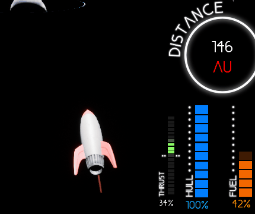
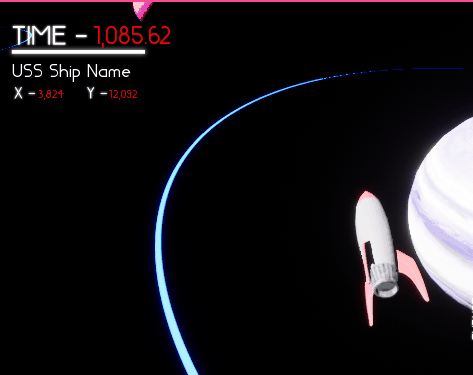
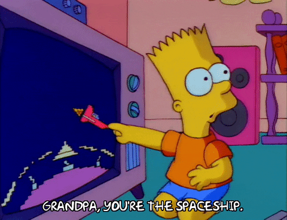

# Deepest Space :rocket: :milky_way:
Our entry to the [48th Ludum Dare](https://ldjam.com/) gamejam! 

Using Unreal Version : 4.26.0

# Deepest Space
Deepest Space is a game inspired by asteroids. 
The aim of the game is to get as deep into space as you can, starting from your home planet. 
Set a high score by getting the furthest you can in the least amount of time! :stopwatch: 
Your rocket's :rocket: fuel will deplete over time, so youl need to harvest planets for more on your trek 
through space!! 
Asteroids will damage your hull so watch out for them! 
You can harvest more fuel from planets by entering their blue rings. 

# Controls
1 - Set Thrust to Forward Max 
2 - Set Thrust to Zero 
3 - Set Thrust to Reverse Max 
W & S  - Manually Control Thrust 
A & D - Rotate to left or right 

# Known Bugs ( We're working on it )
- Not enough asteroids are spawning 

# About Us
We are three game developers who primarily work with C++ 
However we dont have the most experience with Unreal! 
So we're using this gamejam as an opportunity to dive straight in and learn some Unreal! 

- UI & Assets : Isaac Simmons
- Gameplay & Rocket Control : Archie Buck
- Proc Generation & Gameplay : Dr Matt Taylor

